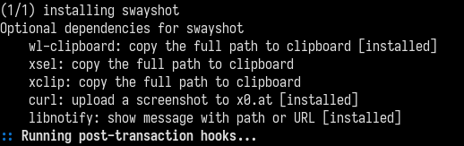

# swayshot #

Screenshot helper for [sway][].

It adds keyboard shortcuts to take screenshot:

-   **Print Scr** made screenshot for whole screen
-   **Alt + Print Scr** made screenshot for a focused window
-   **Shift + Print Scr** made screenshot for a selected region
-   **Super + Print Scr** made screenshot for whole screen then upload it to [x0.at][]
-   **Super + Alt + Print Scr** made screenshot for a focused window then upload it to [x0.at][]
-   **Super + Shift + Print Scr** made screenshot for a selected region then upload it to [x0.at][]

## Customization ##

It saves screenshots to **XDG_PICTURES_DIR** (usually `$HOME/Pictures`), see more details on [XDG user directories][].

Default template of screenshot filename is _screenshot_YYYY-MM-DD_HH24-MI-SS_SSS.png_. But you can change path and timestamp format

User variables in **~/.config/swayshot.sh**.

-   **SWAYSHOT_SCREENSHOTS** defines your own screenshot folder;
-   **SWAYSHOT_DATEFMT** defines timestamp format (see `man date`), thanks [Ranieri Althoff](https://gitlab.com/ranisalt) for help.
-   **SWAYSHOT_WL_COPY_FILE** defines whether the image file itself should be copied to clipboard.

## Path to last screenshot ##

If **wl-clipboard** (wl-copy), **xsel** or **xclip** exist it copies full path to clipboard. Otherwise just prints it to **stdout**.
With **wl-clipboard**, the **SWAYSHOT_WL_COPY_FILE** config variable allows you to copy the image file itself.

## How do I get set up?

### Archlinux

Just install the AUR package [swayshot][swayshot-AUR] ☺

### Other Linux distributions

Requires:
-   grim
-   jq
-   slurp
-   sway (certainly)

Optional dependencies:
-   xsel
-   xclip
-   wl-clipboard

You need to copy files:

-   **swayshot.conf** copy to **/etc/sway/config.d**;
-   **swayshot.sh** copy to **/usr/bin** as **swayshot** and make it executable.

Then just reload Sway's configuration file (usually it's **$mod + Shift + c**).

## Contributing

Please read [Contributing](contributing.md).

## History

See [Changelog](changelog.md)

## License

Copyright 2017,2019,2021 Witalij Berdinskich

This program is free software: you can redistribute it and/or modify
it under the terms of the GNU General Public License as published by
the Free Software Foundation, either version 3 of the License, or
(at your option) any later version.

This program is distributed in the hope that it will be useful,
but WITHOUT ANY WARRANTY; without even the implied warranty of
MERCHANTABILITY or FITNESS FOR A PARTICULAR PURPOSE.  See the
GNU General Public License for more details.

You should have received a copy of the GNU General Public License
along with this program. If not, see https://www.gnu.org/licenses/.

[GNU General Public License, Version 3](license)  

## Acknowledgements

I would like to say thanks to people who point something wrong in my code or propose improvements:

-   [Jonas Meurer](https://gitlab.com/mejo-)
-   [Ranieri Althoff](https://gitlab.com/ranisalt)
-   [Chris Chamberlain](https://gitlab.com/neon64)
-   [Alpha](https://gitlab.com/AlphaShadows)
-   [Kishan Gupta](https://gitlab.com/kishangupta)

[sway]: http://swaywm.org/ "Sway is a drop-in replacement for the i3 window manager, but for Wayland instead of X11"
[x0.at]: https://x0.at "x0.at Filehost. Files are kept for a minimum of 10, and a maximum of 360 Days."
[XDG user directories]: https://wiki.archlinux.org/index.php/XDG_user_directories
[swayshot-AUR]: https://aur.archlinux.org/packages/swayshot/
